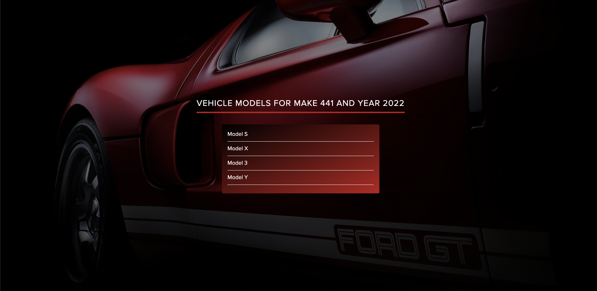

# Car Dealer App

This app enables you to view a list of vehicles based on the selected year and make.

## Technologies Used

- [Next.js](https://nextjs.org/) - A React framework for server-side rendering.
- [TypeScript](https://www.typescriptlang.org/) - A typed superset of JavaScript.
- [ESLint](https://eslint.org/) - A linting utility for JavaScript and TypeScript.
- [Prettier](https://prettier.io/) - An opinionated code formatter.

## Getting Started

### Prerequisites

Make sure you have the following installed on your machine:

- [Node.js](https://nodejs.org/) (v14 or later)
- [npm](https://www.npmjs.com/) (comes with Node.js)

### Installation

1. Clone the repository:

```bash
   git clone https://github.com/lerchik-salata/car_dealer_app.git
```

2. Navigate to project directory:

```bash
   cd car_dealer_app
```

3. Install the dependencies:

```bash
   npm install
```

### Running the application

To start the development server, run:

```bash
   npm run dev
```

### Running the application

To build the application for production, run:

```bash
   npm run build
```

After the build is complete, you can start the application in production mode:

```bash
   npm start
```

### Project structure overview

car_dealer_app/
├── public/                # Static assets (fonts, images, etc.)
│   ├── fonts/             # Font files
│   ├── images/            # Image files
│
├── src/                   # Main application source code
│   ├── app/               # Next.js App Router structure
│   │   ├── layout.tsx     # Root layout for the app
│   │   ├── page.tsx       # Main page (home)
│   │   ├── result/        # Dynamic routes for vehicles
│   │   │   ├── [make]/    # Dynamic folder for vehicle makes
│   │   │   │   ├── [year]/ 
│   │   │   │   │   ├── page.tsx       # Page for specific make and year
│   │   │   │   │   ├── components/    # Components for the specific page
│   │
│   ├── components/        # Reusable React components
│   ├── styles/            # Tailwind, global, and component-specific styles
│   ├── types/             # TypeScript types and interfaces
│
├── .env.local             # Environment variables (API keys, etc.)
├── .eslintrc.js           # ESLint configuration for linting
├── .prettierrc            # Prettier configuration for code formatting
├── package.json           # Project dependencies and npm scripts
└── README.md              # Project documentation (this file)

## Screenshots

### Main page with filters


### Result page


